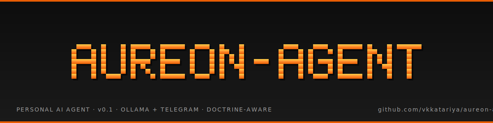

<p align="center">
  
</p>

<p align="center">
  <strong>aureon-agent 🦾</strong> — your personal AI operator.
</p>

<p align="center">
  <a href="https://github.com/vkkatariya/aureon-agent/actions/workflows/ci.yml"></a>
  <a href="https://github.com/vkkatariya/aureon-agent/blob/main/LICENSE"></a>
  <a href="https://github.com/vkkatariya/aureon-agent"></a>
</p>

A **doctrine-aware** personal AI agent for [Vishal "Captain" Katariya](https://vishal-katariya.com). Runs on athena (Radxa Rock 5T, Tailscale-only), talks to you on Telegram, and routes complex work to coding sub-agents (claude-code, opencode, codex, abacus, agy, copilot). Modeled on [Tiny-OpenClaw](https://github.com/ashishbamania/Tiny-OpenClaw) and [OpenClaw](https://github.com/openclaw/openclaw), inspired by [Hermes Agent](https://github.com/NousResearch/hermes-agent) and the Olympus orchestration doctrine.

| | |
|---|---|
| **LLM** | Ollama local (`http://127.0.0.1:11434/v1`) + cloud fallback (`https://ollama.com/v1`) |
| **Channels** | Telegram (primary), Discord (optional) |
| **Storage** | SQLite (sessions + memory) |
| **Skills** | OpenClaw `SKILL.md` format (8 doctrine skills auto-loaded) |
| **Tools** | ReAct loop, MAX_TOOL_ROUNDS=5, streaming responses, plan-node soft check |
| **Style** | Caveman `full` mode always-on in replies |
| **Runtime** | Single Python process, `127.0.0.1` binds only, systemd user service |
| **License** | MIT |

```bash
# first install
git clone https://github.com/vkkatariya/aureon-agent.git ~/dev-shared/projects/aureon-agent
cd ~/dev-shared/projects/aureon-agent
python3.12 -m venv .venv && source .venv/bin/activate
pip install -e .
aureon-agent postinstall
aureon-agent setup       # interactive wizard
aureon-agent start       # or `aureon-agent` (default)
```

```bash
# reconfigure one section
aureon-agent setup --section channel
aureon-agent setup --reset
aureon-agent setup --non-interactive --telegram-bot-token "$TG" --telegram-allowed-chats 723865496
```

```bash
# health check + ops
aureon-agent doctor      # full health probe (skills, DB, env, Telegram, Ollama, systemd)
aureon-agent status       # systemd status
aureon-agent logs         # journalctl -f
aureon-agent stop         # stop the service
```

## What it does

- **Talks to you on Telegram.** Streams responses via `editMessageText`, throttled to 1 edit/sec per chat. Per-chat history in SQLite.
- **Loads doctrine at startup.** `SOUL.md`, `USER.md`, `IDENTITY.md`, `WORKFLOW.md`, `MEMORY.md` from `~/.openclaw/workspace/` via symlinks. One source of truth, no drift.
- **Calls tools via the ReAct loop.** Up to 5 tool rounds per turn. Skills are folders with `SKILL.md` + `handler.py`; agent dispatches via `skill_loader.py`.
- **Soft warns on 3+ step tasks** without a `tasks/todo.md` plan (hard block in v2).
- **Appends to lessons on correction** at `workspace/tasks/lessons.md` per the OpenClaw 6-rule contract.

## Architecture

```
User (Telegram · Discord)
   ↓
Channel Router
   ↓
Session Manager ← SQLite (data/sessions.db)
   ↓
Agent Runtime ← ReAct loop, MAX_TOOL_ROUNDS=5, streaming
   ├→ Context Builder   ← SOUL + IDENTITY + skills + note:* + time
   ├→ Plan Node          ← soft warning if 3+ step task without plan
   └→ Ollama (OpenAI-compat) ← local + cloud fallback
   ↓ (if tool_use)
Skill Loader ← scans workspace/skills/, parses SKILL.md, hot-reload
   ↓
[Skill handlers] ← 8 OpenClaw doctrine skills (caveman, homelab-*, notion, ...)
   ↓
Memory ← SQLite (data/memory.db), note:* namespace injected into system prompt
```

Reference: [`references/tiny-openclaw/`](references/tiny-openclaw/) (8-file Tiny-OpenClaw source, pinned commit `a4cb8cb9`).

## Project layout

```
aureon-agent/
├── main.py                 # back-compat shim
├── pyproject.toml          # console scripts: aureon-agent, aureon-agent-setup, ...
├── aureon_agent/           # main package
│   ├── cli.py              # run bot in foreground
│   ├── setup.py            # interactive wizard
│   ├── doctor.py           # health check
│   ├── postinstall.py      # dep bootstrap
│   ├── config.py           # typed AureonConfig + .env IO
│   └── tui.py              # Rich + Questionary helpers
├── channels/               # base.py, router.py, telegram.py, discord.py
├── assets/
│   └── banner.svg          # THIS banner
├── scripts/
│   └── generate_banner.py  # regenerate the banner
├── tests/                  # smoke.py, test_agent_loop.py, test_config.py
├── references/
│   └── tiny-openclaw/      # vendored reference (pinned)
├── workspace/              # symlinks → ~/.openclaw/workspace/ (doctrine)
├── workflow/               # symlink → ~/dev-shared/workflow/ (shared)
├── docs/                   # setup-script.md, mcp-decision.md (post-v1)
├── tasks/                  # DEVLOG.md, todo.md, lessons.md, kickoff-*.md
└── .env                    # gitignored
```

## Setup modes (mirrors OpenClaw + Hermes)

| Mode | Behavior | Use for |
|---|---|---|
| `aureon-agent setup` | Interactive wizard, shows current values as defaults | First install, full reconfigure |
| `aureon-agent setup --quick` | Only prompts for missing/unset | "I just changed one thing" |
| `aureon-agent setup --non-interactive` | Uses defaults + env vars, no prompts | CI, scripts, automation |
| `aureon-agent setup --reset` | Wipes `.env` via `trash`, runs fresh | Start over cleanly |
| `aureon-agent setup --section <name>` | Re-runs one section | Change one channel, swap LLM, etc. |

Sections: `model | channel | daemon | skills | workspace | all`.

## Safety

- **No `0.0.0.0` binds.** Localhost or Tailscale only.
- **Telegram chat ID allowlist.** Drop messages from non-allowed chats silently.
- **Caveman mode always-on** in replies (per `agent.environment_hint` + SOUL.md).
- **OpenClaw config (`~/.openclaw/openclaw.json`) is locked.** Read-only inspection OK, any write → ask first.
- **Scope discipline** — write what was asked, stop, don't add scope. (Lesson from 2026-06-16/17.)

## Status

**v0.1 (current)** — Phase 0-5 done. Phase 6-8 in progress. See [`tasks/todo.md`](tasks/todo.md) for the full roadmap.

- ✅ Live Telegram round-trip verified end-to-end (modeled on Tiny-OpenClaw's 8-component architecture)
- ✅ Doctrine symlinked to `~/.openclaw/workspace/` (8 skills auto-load)
- ✅ SQLite sessions + memory
- ✅ Plan-node soft warning on 3+ step tasks
- ⏳ Interactive setup script (`aureon-agent setup`) — coming in Phase 8
- ⏳ systemd user service — coming in Phase 6
- ⏳ MCP integration (Notion, Gmail, GitHub) — coming in Phase 7

## Development

```bash
# run tests
source .venv/bin/activate
python tests/smoke.py
python tests/test_agent_loop.py

# regenerate the banner (after font/color changes)
python scripts/generate_banner.py

# check health
aureon-agent doctor
```

See [`CLAUDE.md`](CLAUDE.md) for the project context block, [`CONTEXT.md`](CONTEXT.md) for the stack snapshot, and [`AGENTS.md`](AGENTS.md) for the 6-rule per-project contract.

## License

MIT — see [LICENSE](LICENSE).

## Acknowledgments

- [ashishbamania/Tiny-OpenClaw](https://github.com/ashishbamania/Tiny-OpenClaw) — 8-component reference architecture, vendored at `references/tiny-openclaw/`
- [openclaw/openclaw](https://github.com/openclaw/openclaw) — the original OpenClaw agent (Peter Steinberger)
- [NousResearch/hermes-agent](https://github.com/NousResearch/hermes-agent) — Olympus orchestration doctrine, agent router patterns, setup-wizard conventions
- [ashishbamania/Into-AI](https://substack.com/home/post/p-193348119) — the build walkthrough that became the reference port
